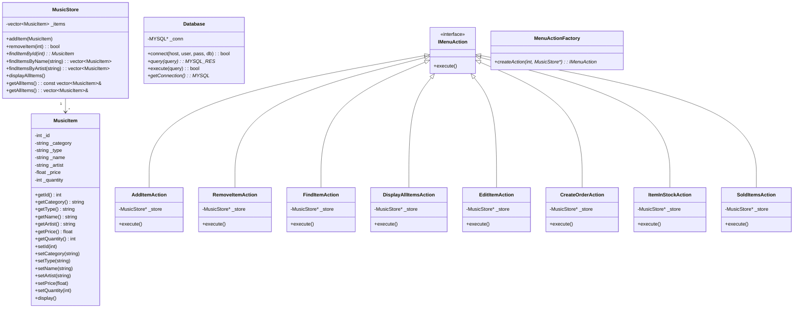

# 🎵 Music Store Management System (OOP + SOLID + Factory)

## 🧩 Class Diagram

```mermaid
classDiagram
    class MusicItem {
        -int _id
        -string _category
        -string _type
        -string _name
        -string _artist
        -float _price
        -int _quantity
        +getId() int
        +getCategory() string
        +getType() string
        +getName() string
        +getArtist() string
        +getPrice() float
        +getQuantity() int
        +setId(int)
        +setCategory(string)
        +setType(string)
        +setName(string)
        +setArtist(string)
        +setPrice(float)
        +setQuantity(int)
        +display()
    }

    class MusicStore {
        -vector~MusicItem~ _items
        +addItem(MusicItem)
        +removeItem(int): bool
        +findItemById(int): MusicItem*
        +findItemsByName(string): vector~MusicItem~
        +findItemsByArtist(string): vector~MusicItem~
        +displayAllItems()
        +getAllItems(): const vector~MusicItem~&
        +getAllItems(): vector~MusicItem~&
    }

    class Database {
        -MYSQL* _conn
        +connect(host, user, pass, db): bool
        +query(query): MYSQL_RES*
        +execute(query): bool
        +getConnection(): MYSQL*
    }

    class IMenuAction {
        <<interface>>
        +execute()
    }

    class AddItemAction {
        -MusicStore* _store
        +execute()
    }

    class RemoveItemAction {
        -MusicStore* _store
        +execute()
    }

    class FindItemAction {
        -MusicStore* _store
        +execute()
    }

    class DisplayAllItemsAction {
        -MusicStore* _store
        +execute()
    }

    class EditItemAction {
        -MusicStore* _store
        +execute()
    }

    class CreateOrderAction {
        -MusicStore* _store
        +execute()
    }

    class ItemInStockAction {
        -MusicStore* _store
        +execute()
    }

    class SoldItemsAction {
        -MusicStore* _store
        +execute()
    }

    class MenuActionFactory {
        +createAction(int, MusicStore*): IMenuAction*
    }

    %% Relationships
    MusicStore "1" --> "*" MusicItem
    IMenuAction <|-- AddItemAction
    IMenuAction <|-- RemoveItemAction
    IMenuAction <|-- FindItemAction
    IMenuAction <|-- DisplayAllItemsAction
    IMenuAction <|-- EditItemAction
    IMenuAction <|-- CreateOrderAction
    IMenuAction <|-- ItemInStockAction
    IMenuAction <|-- SoldItemsAction
```