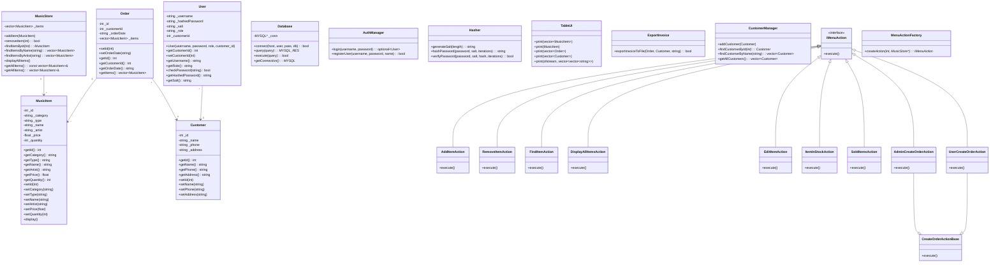

# 🎵 Music Store Management System (OOP + SOLID + Factory)

## 🧩 Class Diagram

```mermaid
classDiagram
    class MusicItem {
        -int _id
        -string _category
        -string _type
        -string _name
        -string _artist
        -float _price
        -int _quantity
        +getId() int
        +getCategory() string
        +getType() string
        +getName() string
        +getArtist() string
        +getPrice() float
        +getQuantity() int
        +setId(int)
        +setCategory(string)
        +setType(string)
        +setName(string)
        +setArtist(string)
        +setPrice(float)
        +setQuantity(int)
        +display()
    }

    class MusicStore {
        -vector~MusicItem~ _items
        +addItem(MusicItem)
        +removeItem(int): bool
        +findItemById(int): MusicItem*
        +findItemsByName(string): vector~MusicItem~
        +findItemsByArtist(string): vector~MusicItem~
        +displayAllItems()
        +getAllItems(): const vector~MusicItem~&
        +getAllItems(): vector~MusicItem~&
    }

    class Customer {
        -int _id
        -string _name
        -string _phone
        -string _address
        +getId() int
        +getName() string
        +getPhone() string
        +getAddress() string
        +setId(int)
        +setName(string)
        +setPhone(string)
        +setAddress(string)
    }

    class User {
        -string _username
        -string _hashedPassword
        -string _salt
        -string _role
        -int _customerId
        +User(username, password, role, customer_id)
        +getCustomerId() int
        +setCustomerId(int)
        +getUsername() string
        +getRole() string
        +checkPassword(string) bool
        +getHashedPassword() string
        +getSalt() string
    }

    class Order {
        -int _id
        -int _customerId
        -string _orderDate
        -vector~MusicItem~ _items
        +setId(int)
        +setOrderDate(string)
        +getId() int
        +getCustomerId() int
        +getOrderDate() string
        +getItems() vector~MusicItem~
    }

    class Database {
        -MYSQL* _conn
        +connect(host, user, pass, db): bool
        +query(query): MYSQL_RES*
        +execute(query): bool
        +getConnection(): MYSQL*
    }

    class AuthManager {
        +login(username, password): optional~User~
        +registerUser(username, password, name): bool
    }

    class Hasher {
        +generateSalt(length): string
        +hashPassword(password, salt, iterations): string
        +verifyPassword(password, salt, hash, iterations): bool
    }

    class TableUI {
        +print(vector~MusicItem~)
        +print(MusicItem)
        +print(vector~Order~)
        +print(vector~Customer~)
        +print(ofstream, vector~vector~string~~)
    }

    class ExportInvoice {
        +exportInvoiceToFile(Order, Customer, string): bool
    }

    class CustomerManager {
        +addCustomer(Customer)
        +findCustomerById(int): Customer*
        +findCustomerByName(string): vector~Customer~
        +getAllCustomers(): vector~Customer~
    }

    class IMenuAction {
        <<interface>>
        +execute()
    }

    class AddItemAction {
        +execute()
    }
    class RemoveItemAction {
        +execute()
    }
    class FindItemAction {
        +execute()
    }
    class DisplayAllItemsAction {
        +execute()
    }
    class EditItemAction {
        +execute()
    }
    class ItemInStockAction {
        +execute()
    }
    class SoldItemsAction {
        +execute()
    }
    class AdminCreateOrderAction {
        +execute()
    }
    class UserCreateOrderAction {
        +execute()
    }
    class CreateOrderActionBase {
        +execute()
    }

    class MenuActionFactory {
        +createAction(int, MusicStore*): IMenuAction*
    }

    %% Relationships
    MusicStore "1" --> "*" MusicItem
    Order "1" --> "*" MusicItem
    Order "*" --> "1" Customer
    User "*" --> "1" Customer
    IMenuAction <|-- AddItemAction
    IMenuAction <|-- RemoveItemAction
    IMenuAction <|-- FindItemAction
    IMenuAction <|-- DisplayAllItemsAction
    IMenuAction <|-- EditItemAction
    IMenuAction <|-- ItemInStockAction
    IMenuAction <|-- SoldItemsAction
    IMenuAction <|-- AdminCreateOrderAction
    IMenuAction <|-- UserCreateOrderAction
    AdminCreateOrderAction --|> CreateOrderActionBase
    UserCreateOrderAction --|> CreateOrderActionBase
```
